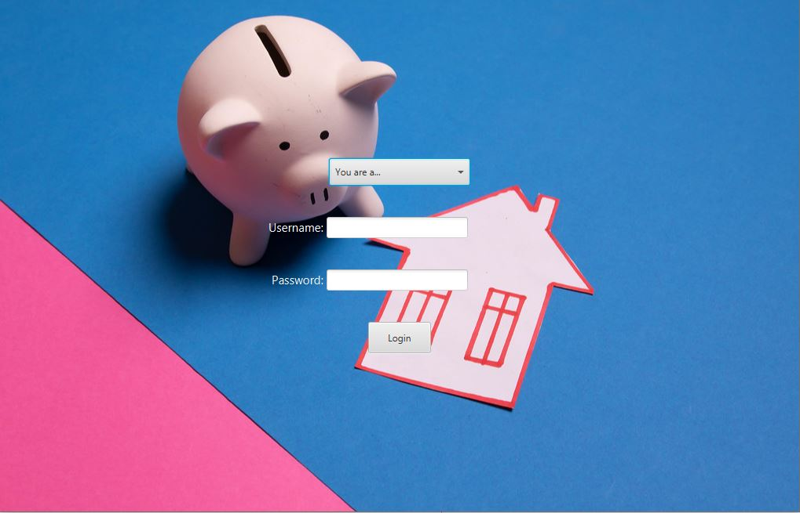
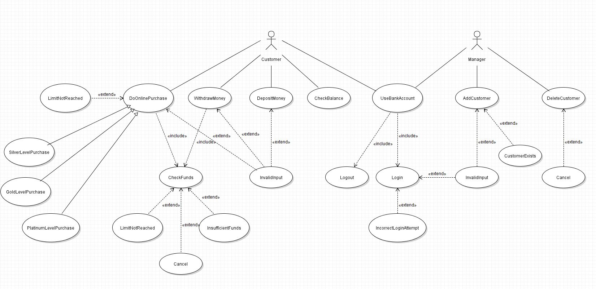
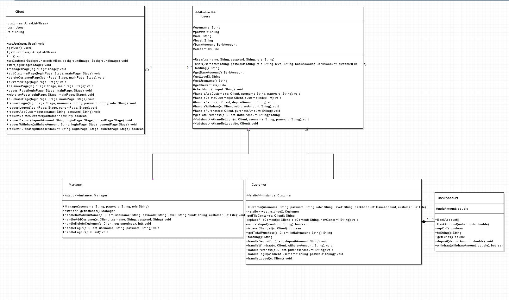
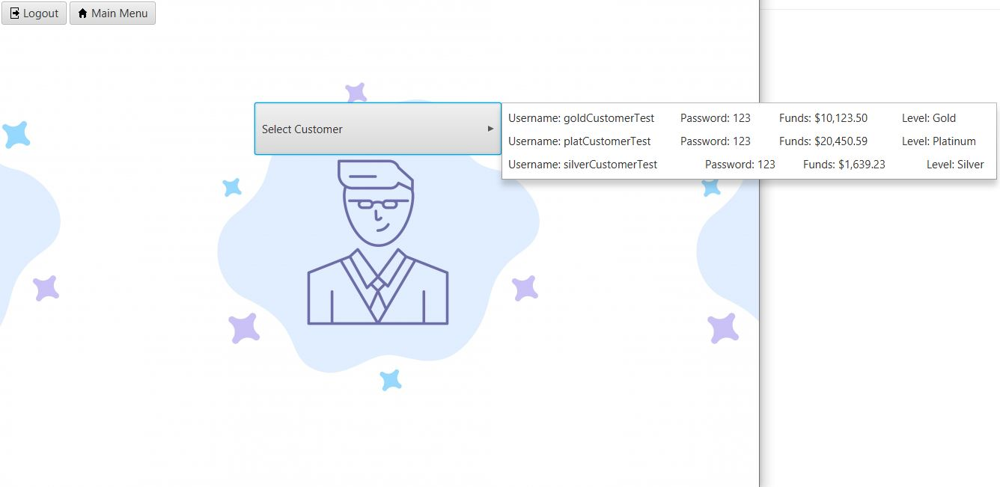

# Bank Account System
This project incorporates concepts in object oriented analysis and design to create a bank application that is GUI based.
The app will use a state design pattern and also feature UML use-case and class diagrams. The diagrams were made on VioletUMLEditor

